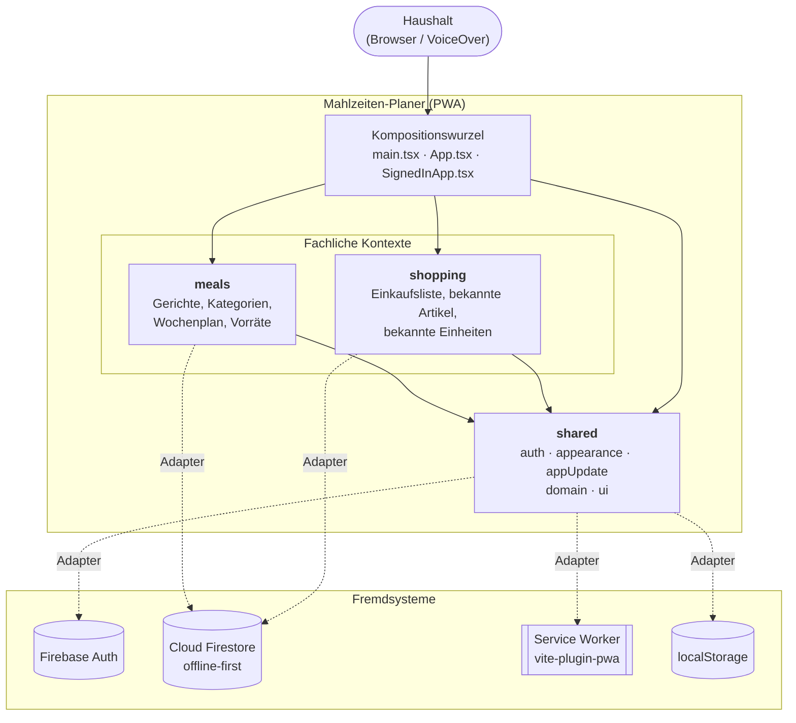
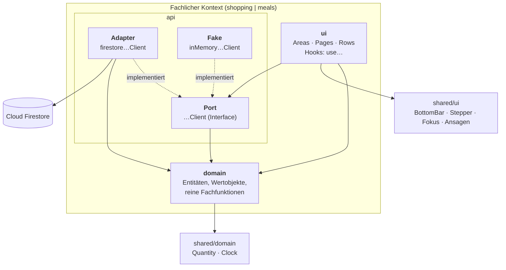
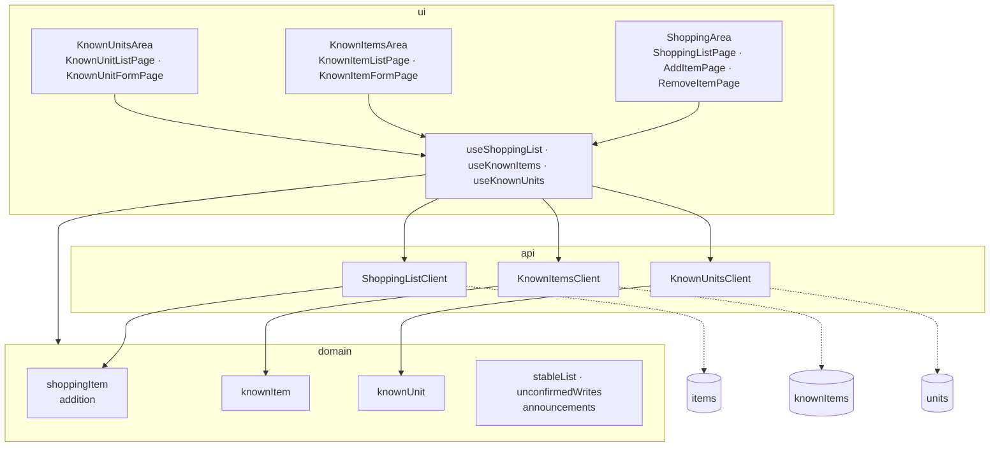
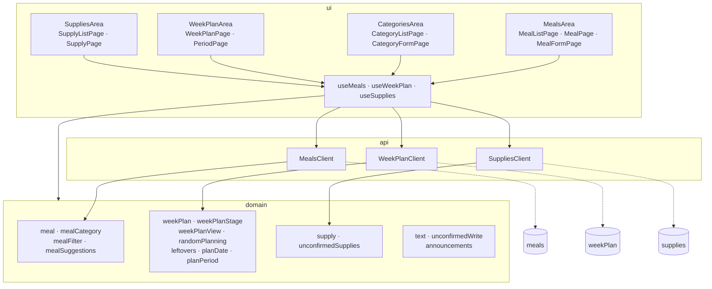
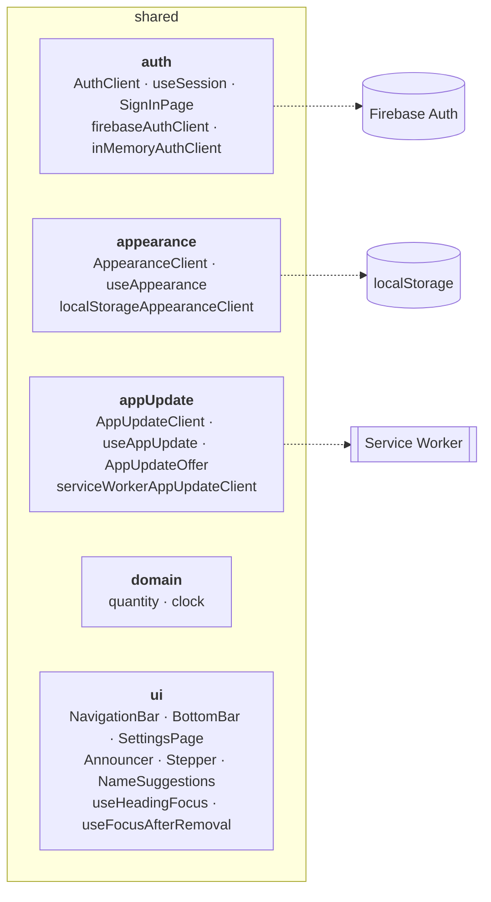

# 5 Bausteinsicht

Bausteinsicht des Mahlzeiten-Planers nach arc42, Kapitel 5. Die Diagramme sind in
Mermaid gezeichnet und spiegeln den Stand des Codes unter `src/` wider.

## 5.1 Ebene 1 – Whitebox Gesamtsystem

`shopping` und `meals` kennen einander nicht. Die einzige Verbindung – Gerichte und
Wochenplan auf die Einkaufsliste übertragen – stellt die Kompositionswurzel in
`SignedInApp.tsx` her.

### Enthaltene Bausteine

| Baustein | Verantwortung |
| --- | --- |
| **Kompositionswurzel** | `main.tsx` erzeugt die echten Adapter (Firestore, Firebase Auth, Service Worker, localStorage) und reicht sie an `App` durch. `App` regelt Anmeldung, Darstellung und App-Update. `SignedInApp` setzt die Bereiche zusammen, steuert die Navigation und übersetzt zwischen `meals` und `shopping`. |
| **shopping** | Die gemeinsame Einkaufsliste: Artikel anlegen, Menge ändern, abhaken, aufräumen. Pflegt die bekannten Artikel und Einheiten für Vorschläge beim Tippen. |
| **meals** | Die Gerichte des Haushalts mit Kategorien und Kennzeichnungen, der Wochenplan samt Zufallsauswahl und Regeln sowie die Vorräte. |
| **shared** | Kontextübergreifendes: Anmeldung, Darstellung (Farbumkehr), App-Update, gemeinsame Domänenwerte (`Quantity`, `Clock`) und Bedienelemente für Navigation, Fokus und Ansagen. |

### Schnittstellen nach außen

| Fremdsystem | Genutzt von | Zweck |
| --- | --- | --- |
| Cloud Firestore | `shopping`, `meals` | Gemeinsamer Datenbestand des Haushalts, offline-first synchronisiert. |
| Firebase Auth | `shared/auth` | Ein gemeinsames Konto für den Haushalt. |
| Service Worker | `shared/appUpdate` | Offline-Betrieb und Angebot neuer Versionen. |
| localStorage | `shared/appearance` | Gerätelokale Darstellungseinstellung. |

## 5.2 Ebene 2 – Whitebox eines fachlichen Kontexts

Beide Kontexte sind gleich geschnitten. Die Abhängigkeiten zeigen nach innen zur Domäne.

| Schicht | Verantwortung | Regeln |
| --- | --- | --- |
| **domain** | Fachliche Typen und Regeln als reine Funktionen. | Kennt weder React noch Firebase. Test-getrieben, ohne Framework. |
| **api** | Port als `…Client`-Interface, dazu der Firestore-Adapter für den Betrieb und der In-Memory-Fake für Tests. | Adapter übersetzen zwischen Firestore-Dokumenten und Domänentypen. |
| **ui** | React-Komponenten und Hooks. Die Hooks halten den Zustand, sprechen den Port an und rufen die Domäne. | Kennt nur den Port, nie den Firestore-Adapter. |

## 5.3 Ebene 2 – Whitebox shopping

## 5.4 Ebene 2 – Whitebox meals

## 5.5 Ebene 2 – Whitebox shared

`shared` hängt von keinem fachlichen Kontext ab. Auch hier liegen Port, echter Adapter
und In-Memory-Fake jeweils zusammen in einem Ordner.
